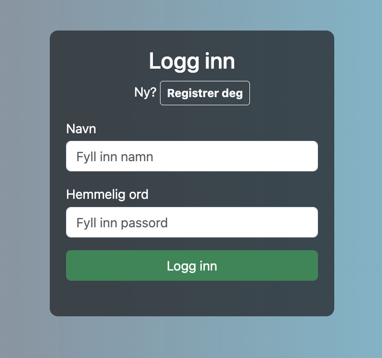
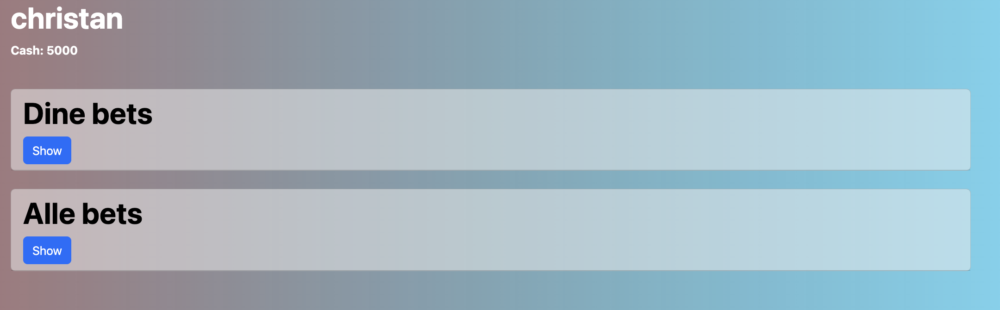

# FriendlyBet

## Table of contencts

- [Installation](#installation)
- [Description](#description)
- [Graphics](#Graphics)
- [Contact](#contact)

## Installation

1. Clone the repository
2. Run `npm install` in the root directory
3. Run `npm run build-client` in the root directory
4. Run `npm run build-server` in the root directory

### Usage

1. Run `npm run start-server` in the root directory
2. Run `npm run start-client` in the root directory from antoher terminal
3. Open `localhost:3000` in your browser

## Description

This project is a web application for creating and managing bets between friends. The application is built with React, Node.js and Express. The application uses a noSQL database to store user data and bets. The application is built with a focus on user experience and simplicity.

### Features

- Create and manage bets
- Invite friends to join bets
- Create and manage users
- Leaderboard
- Administrator functionality

### Motivation

My motivation for this project was to gain more experience with full-stack development and to create a project that I could use with my friends.

## Graphics

### Login page

### Landing page

## Contact

If you have any questions or want to get in touch, you can reach me at:

- [Github](https://github.com/chrvei00)
- [LinkedIn](https://www.linkedin.com/in/christian-veiby)
- [christian@veiby.com](mailto:christian@veiby.com)
